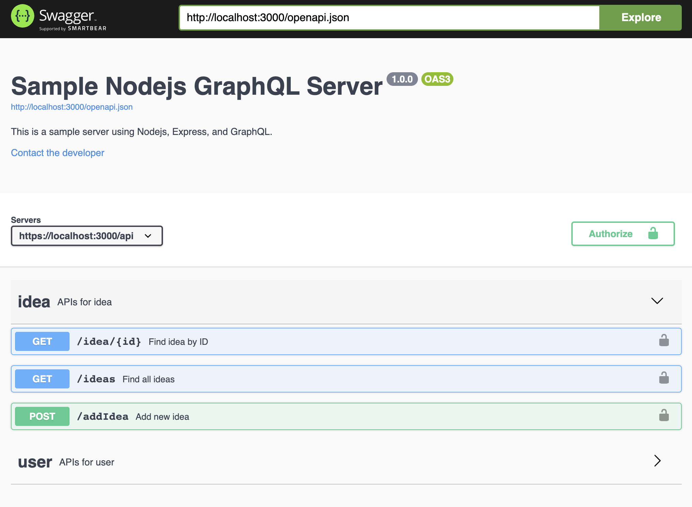

# IDEAs-Manager

Simple Ideas storing APIs using GraphQL, Express Nodejs, SwaggerUI, and MongoDB.

###### Overall view

- Created an advanced way to extract and add data toward MongoDB using GraphQL querying flexibility

- Used a Nodejs router layer to handle standard Restful APIs

- Added SwaggerUI to provide interactive integration testing

## Development server

Run `nodemon index.js` for a dev server. Navigate to `http://localhost:3000/`. The app will automatically reload if you change any of the source files.

## SwaggerUI

Navigate to `http://localhost:3000/swagger` to interact with SwaggerUI. 

